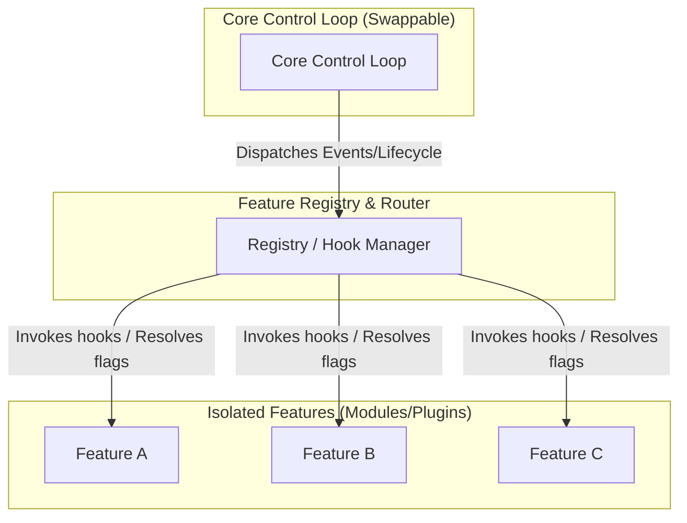

# Agentic Architecture & Design Philosophy (AGENTIC_ARCH)

This document outlines a modern software design philosophy tailored for development using **agentic AI systems**. 

Traditional software engineering paradigms (such as DRY, high levels of abstraction, and deep class hierarchies) were optimized to overcome the limits of **human typing speed, reading speed, and manual refactoring**. In an agentic development paradigm, the bottleneck shifts from typing speed to **cognitive context size, logical reasoning, and risk of side-effects**.

With AI systems possessing near-infinite "typing speed" and rapid code-generation abilities, we can design applications that prioritize **high isolation, clean pluggability, and modular testability**, leading to highly maintainable (*ylläpidettävä*) codebases.

---

## The Feature-Agent-Spec Technique

The **Feature-Agent-Spec** (or **Agent-Spec**) technique is the operational workflow that applies these design principles to human-AI co-development:

1. **The Feature Spec**: For any new capability, a specification (e.g., `features/my_feature/README.md` or an implementation plan) is written. This document defines the inputs, outputs, UI behavior, and expectations.
2. **Autonomous Sandboxed Implementation**: The AI agent is assigned the specification and works entirely inside the feature's directory (`features/my_feature/`). It creates the code, style sheets, and tests locally without altering shared global code.
3. **Registration & Configuration**: The feature is integrated via the registry and controlled with feature flags in a configuration file (like `config.js`).
4. **Zero-Impact Removal**: Deleting the feature's folder and toggling its flag off fully removes the feature with zero remnant code.

This methodology prevents AI agents from creating side-effects in other parts of the system, limits the required context window size, and keeps the project's commit history organized.

---

## 1. Core Architecture Principles



### 1.1. Feature Isolation & Modularization
A "feature" is any modular enhancement to the system—whether a plugin, extension, UI module, or API integration. 
* **Complete Decoupling**: Each feature should reside in its own folder or module boundary.
* **No Direct Core Imports**: Features must register themselves with the system or consume core interfaces rather than hardcoding imports into the core control loop.
* **Uni-directional Dependencies**: Features can depend on the Core/Common interfaces, but the Core should never have compile-time or static import dependencies on individual features.

### 1.2. Strict Feature Flagging
Every feature must be easily controlled through configuration.
* **Toggleable**: A feature must be disableable or enableable via a configuration file, environment variable, or feature flag registry. Disabling a feature should dynamically prune its routes, assets, and event listeners.
* **Removable (Zero-Remnant Deletion)**: Deleting a feature's directory and its entry in the configuration registry must be sufficient to remove it entirely. The application must still compile and pass all tests without leaving broken references or dead code path warnings.

### 1.3. Explicit and Swappable Core Control Loops
The core control loop represents the program's lifecycle orchestrator (e.g., event dispatch loop, server startup, main UI loop).
* **Core Loop is Not a Feature**: The core loop coordinates *how* features are loaded, run, and terminated. It is part of the system infrastructure, not the domain logic.
* **Swappable Implementation**: The control loop should be defined as a clean contract (e.g., an interface or abstract driver). This makes it possible to replace the core control loop with an entirely different implementation (e.g., swapping a polling-based engine for an event-driven engine) without rewriting the features themselves.

---

## 2. Shift in Design Priorities

| Traditional Development (Human-Focused) | Agentic Development (AI-Focused) | Why This Promotes Maintainability (*Ylläpidettävyys*) |
| :--- | :--- | :--- |
| **Highly Compressed Abstractions (DRY)** | **Isolated Repetition / Localized Context** | AI handles copy-pasting and generation easily; localized, explicit code is easier for AI context windows to read and safely modify. |
| **Monolithic Single File Layouts** | **Strict Directory-per-Feature Structure** | Minimizes conflict during edits and limits the amount of code the AI needs to read to understand a single feature. |
| **Hardcoded Integrations** | **Registry & Hook-Based Integrations** | Features can be added/removed by adding/deleting directories without modifying main branch logic. |
| **Manual Dev Flags** | **Strict Configuration-Driven Flags** | Simplifies automatic code removal, testing under various configurations, and canary rollouts. |

---

## 3. Implementation Patterns

To enforce these principles, projects should adopt the following design patterns:

### 3.1. The Hook / Event Registry Pattern
Instead of the core loop directly calling feature functions, the core loop defines **lifecycle hooks** or dispatches **events**. Features register callbacks for these hooks.

*Example (Conceptual TypeScript):*
```typescript
// Core Loop Definition
interface SystemHook {
  onStartup(): Promise<void>;
  onShutdown(): Promise<void>;
}

class CoreRegistry {
  private hooks: SystemHook[] = [];

  register(hook: SystemHook) {
    this.hooks.push(hook);
  }

  async runStartup() {
    for (const hook of this.hooks) {
      await hook.onStartup();
    }
  }
}
```

### 3.2. Configuration-Driven Loading
Feature flags dictate which features are loaded at initialization.

*Example configuration (`features.config.json`):*
```json
{
  "features": {
    "gpxPlaythrough": { "enabled": true, "path": "./features/gpx-playthrough" },
    "photoSlideshow": { "enabled": false, "path": "./features/photo-slideshow" }
  }
}
```

### 3.3. Swappable Core Interface
By packaging the core loop behind an interface, the main entry point becomes a thin launcher that instantiates the active runner.

*Example launcher (`main.ts`):*
```typescript
interface ControlLoop {
  initialize(): Promise<void>;
  start(): Promise<void>;
}

// Swapping the loop implementation based on environment or settings
const controlLoop: ControlLoop = process.env.ENGINE_TYPE === 'event-driven'
  ? new EventDrivenControlLoop()
  : new SimplePollingControlLoop();

await controlLoop.initialize();
await controlLoop.start();
```

---

## 4. Guidelines for AI Agents

When working on a codebase adhering to this architecture, agents must follow these rules:

1. **Feature Additions**: Create a new subdirectory under `features/` or `plugins/`. Do not modify the core engine files directly, except to register the plugin configuration or feature flag.
2. **Feature Removal**: Test feature removal by deleting the folder and ensuring the app compiles, runs, and passes its tests with the flag disabled.
3. **No Cross-Talk**: Avoid imports between separate features. If Feature A needs to communicate with Feature B, they must communicate via event buses or shared state stores exposed by the Core.
4. **Documentation**: Every feature directory must contain its own README explaining its inputs, outputs, and exposed hooks/events.
