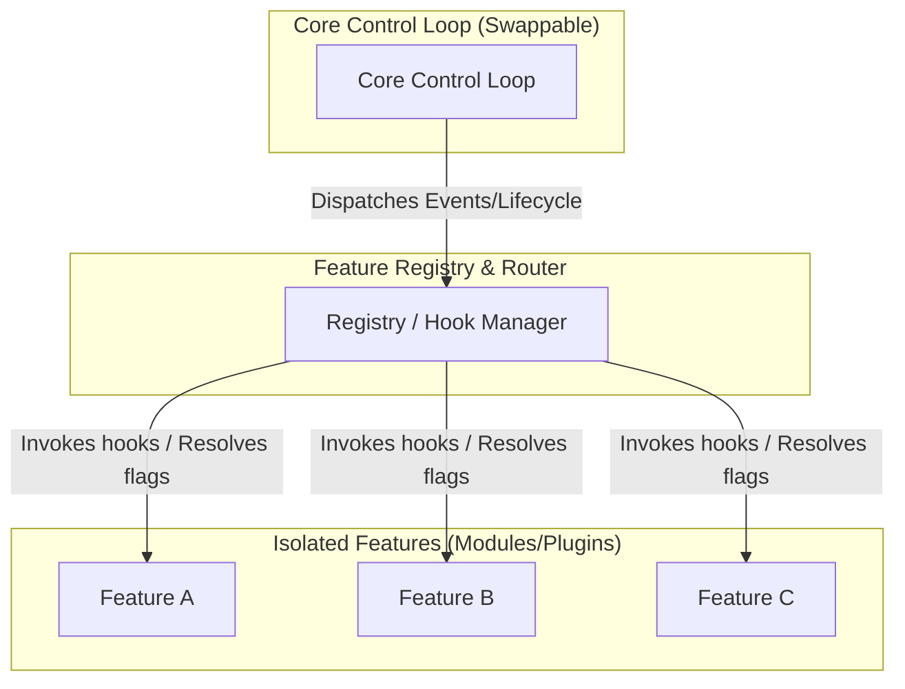

# Feature-Agent-Spec: Agentic Architecture & Design Philosophy (FEATURE_AGENT_SPEC-1.2.0)

**Specification Version**: 1.2.0  
**Status**: Active  
**Last Updated**: 2026-05-31

### Version History

| Version | Date | Description of Changes |
| :--- | :--- | :--- |
| **1.2.0** | 2026-05-31 | Added Section 9 (Cross-Language Implementation Guidelines) referencing the new LANGUAGES.md document detailing compatibility across 10 major programming languages. |
| **1.1.0** | 2026-05-31 | Expanded Section 8 with a detailed Code Redundancy analysis, introducing the Multi-Tier Utility Pipeline, AST-based duplicate detection, and the Bridge Adapter pattern for stateful services. |
| **1.0.0** | 2026-05-31 | Initial complete release. Added dynamic asset loading guidelines (Section 1.2), Matrix Testing (Section 6), and referenced the compliant GPX Photo Map Playthrough example (Section 5). |

---

This document outlines the **Feature-Agent-Spec** software design philosophy, a modern engineering paradigm tailored for co-development using **agentic AI systems** in team environments. 

Traditional software engineering paradigms (such as DRY, high levels of abstraction, and deep class hierarchies) were optimized to overcome the limits of **human typing speed, reading speed, and manual refactoring**. In an agentic development paradigm, the bottleneck shifts from typing speed to **cognitive context size, logical reasoning, and risk of side-effects**.

With AI systems possessing near-infinite "typing speed" and rapid code-generation abilities, we can design applications that prioritize **high isolation, clean pluggability, and modular testability**, leading to highly maintainable (*ylläpidettävä*) codebases.

---

## The Feature-Agent-Spec Technique

The **Feature-Agent-Spec** technique is the operational workflow that applies these design principles to human-AI co-development:

1. **The Feature Spec**: For any new capability, a specification (e.g., `features/my_feature/README.md` or an implementation plan) is written. This document defines the inputs, outputs, UI behavior, and expectations.
2. **Autonomous Sandboxed Implementation**: The AI agent is assigned the specification and works entirely inside the feature's directory (`features/my_feature/`). It creates the code, style sheets, and tests locally without altering shared global code.
3. **Registration & Configuration**: The feature is integrated via the registry and controlled with feature flags in a configuration file (like `config.js`).
4. **Zero-Impact Removal**: Deleting the feature's folder and toggling its flag off fully removes the feature with zero remnant code.

This methodology prevents AI agents from creating side-effects in other parts of the system, limits the required context window size, and keeps the project's commit history organized.

---

## 1. Core Architecture Principles



### 1.1. Feature Isolation & Modularization
A "feature" is any modular enhancement to the system—whether a plugin, extension, UI module, or API integration. 
* **Complete Decoupling**: Each feature should reside in its own folder or module boundary.
* **No Direct Core Imports**: Features must register themselves with the system or consume core interfaces rather than hardcoding imports into the core control loop.
* **Uni-directional Dependencies**: Features can depend on the Core/Common interfaces, but the Core should never have compile-time or static import dependencies on individual features.

### 1.2. Strict Feature Flagging
Every feature must be easily controlled through configuration.
* **Toggleable**: A feature must be disableable or enableable via a configuration file, environment variable, or feature flag registry. Disabling a feature should dynamically prune its routes, assets, and event listeners.
* **Removable (Zero-Remnant Deletion)**: Deleting a feature's directory and its entry in the configuration registry must be sufficient to remove it entirely. The application must still compile and pass all tests without leaving broken references or dead code path warnings.
* **Best Practice (Dynamic Asset Loading)**: To prevent browser network warnings (404 errors) or compilation failures when a feature directory is deleted, main entry-point templates (like `index.html` or `App.tsx`) should avoid hardcoding `<script>` or `<link>` stylesheet tags for individual features. Instead, they should dynamically inject these scripts and styles at runtime based on the enabled flags in the configuration registry. This guarantees that deleting a folder is completely zero-touch and doesn't leak dead asset calls.

### 1.3. Explicit and Swappable Core Control Loops
The core control loop represents the program's lifecycle orchestrator (e.g., event dispatch loop, server startup, main UI loop).
* **Core Loop is Not a Feature**: The core loop coordinates *how* features are loaded, run, and terminated. It is part of the system infrastructure, not the domain logic.
* **Swappable Implementation**: The control loop should be defined as a clean contract (e.g., an interface or abstract driver). This makes it possible to replace the core control loop with an entirely different implementation (e.g., swapping a polling-based engine for an event-driven engine) without rewriting the features themselves.

---

## 2. Shift in Design Priorities

| Traditional Development (Human-Focused) | Agentic Development (AI-Focused) | Why This Promotes Maintainability (*Ylläpidettävyys*) |
| :--- | :--- | :--- |
| **Highly Compressed Abstractions (DRY)** | **Isolated Repetition / Localized Context** | AI handles copy-pasting and generation easily; localized, explicit code is easier for AI context windows to read and safely modify. |
| **Monolithic Single File Layouts** | **Strict Directory-per-Feature Structure** | Minimizes conflict during edits and limits the amount of code the AI needs to read to understand a single feature. |
| **Hardcoded Integrations** | **Registry & Hook-Based Integrations** | Features can be added/removed by adding/deleting directories without modifying main branch logic. |
| **Manual Dev Flags** | **Strict Configuration-Driven Flags** | Simplifies automatic code removal, testing under various configurations, and canary rollouts. |

---

## 3. Implementation Patterns

To enforce these principles, projects should adopt the following design patterns:

### 3.1. The Hook / Event Registry Pattern
Instead of the core loop directly calling feature functions, the core loop defines **lifecycle hooks** or dispatches **events**. Features register callbacks for these hooks.

*Example (Conceptual TypeScript):*
```typescript
// Core Loop Definition
interface SystemHook {
  onStartup(): Promise<void>;
  onShutdown(): Promise<void>;
}

class CoreRegistry {
  private hooks: SystemHook[] = [];

  register(hook: SystemHook) {
    this.hooks.push(hook);
  }

  async runStartup() {
    for (const hook of this.hooks) {
      await hook.onStartup();
    }
  }
}
```

### 3.2. Configuration-Driven Loading
Feature flags dictate which features are loaded at initialization.

*Example configuration (`features.config.json`):*
```json
{
  "features": {
    "gpxPlaythrough": { "enabled": true, "path": "./features/gpx-playthrough" },
    "photoSlideshow": { "enabled": false, "path": "./features/photo-slideshow" }
  }
}
```

### 3.3. Swappable Core Interface
By packaging the core loop behind an interface, the main entry point becomes a thin launcher that instantiates the active runner.

*Example launcher (`main.ts`):*
```typescript
interface ControlLoop {
  initialize(): Promise<void>;
  start(): Promise<void>;
}

// Swapping the loop implementation based on environment or settings
const controlLoop: ControlLoop = process.env.ENGINE_TYPE === 'event-driven'
  ? new EventDrivenControlLoop()
  : new SimplePollingControlLoop();

await controlLoop.initialize();
await controlLoop.start();
```

---

## 4. Guidelines for AI Agents

When working on a codebase adhering to this architecture, agents must follow these rules:

1. **Feature Additions**: Create a new subdirectory under `features/` or `plugins/`. Do not modify the core engine files directly, except to register the plugin configuration or feature flag.
2. **Feature Removal**: Test feature removal by deleting the folder and ensuring the app compiles, runs, and passes its tests with the flag disabled.
3. **No Cross-Talk**: Avoid imports between separate features. If Feature A needs to communicate with Feature B, they must communicate via event buses or shared state stores exposed by the Core.
4. **Documentation**: Every feature directory must contain its own README explaining its inputs, outputs, and exposed hooks/events.

---

## 5. Real-World Examples

To see the Feature-Agent-Spec in action, refer to the following implementation:

* **[GPX Photo Map Playthrough](https://github.com/ljack/feature-agent-spec-gpx-photo-map-playthrough)**: A fully compliant vanilla JavaScript and CSS web application demonstrating the core registry system, dynamic feature loading, zero-remnant removability, and configuration-driven testing.

---

## 6. Testing in the Feature-Agent-Spec Paradigm

Because features are strictly isolated, testing is divided into distinct, automated phases that verify feature-level independence, flag configurations, and zero-remnant removability.

### 6.1. Sandbox Unit Testing
* **Location**: Each feature must contain its own test files within its directory (e.g., `features/my_feature/tests/`).
* **Mocking**: Tests must mock core system drivers and interfaces. The feature should be testable without starting the global application or DB layers.

### 6.2. Flag-Matrix Test Suite
In a system with multiple toggleable features, configurations can vary. The CI pipeline should execute tests under a matrix of configurations:
1. **Core-Only**: All feature flags disabled. Validates that core functionalities remain intact and compile.
2. **Solo-Feature**: Enable exactly one feature at a time. Ensures that Feature A does not implicitly depend on Feature B being active.
3. **All-Active**: All feature flags enabled. Ensures inter-feature co-existence.

### 6.3. Automated Zero-Remnant Verification
To prove a feature can be cleanly deleted, the testing pipeline includes a verification script:
1. A configuration matrix lists each feature.
2. For each feature, the script temporarily moves the feature directory out of the codebase (e.g., to a temp folder).
3. The script toggles the feature's config flag to `false`.
4. The script executes the compiler, linter, and core test suite.
5. If compilation fails or any test breaks, it indicates a **Remnant Violation** (the core or another feature had hardcoded references to the deleted feature).

---

## 7. Detecting and Preventing Rule Violations

With multiple AI agents and humans contributing to a codebase, automated checks must guard the architecture boundaries.

### 7.1. Dependency Cruising (Static Analysis)
Static analysis tools (e.g., ESLint dependency rules, `dependency-cruiser`, or custom AST parsing scripts) must be configured with rules that run on pre-commit hooks and CI:
* **Core Isolation Rule**: Core source files (`core/*`) are forbidden from importing from `features/*`.
* **Sandbox Rule (No Cross-Talk)**: Files in `features/feature_a/*` are forbidden from importing from `features/feature_b/*`.
* **Registration Exception**: Only the configuration script (`config.js`) and the main registry launcher are permitted to import the feature entry points.

### 7.2. Automated Removability Gate (CI)
The "Zero-Remnant Verification" test described in Section 6.3 should run as a blocking check in the CI/CD pipeline on every Pull Request. Any PR that leaves dead imports or references in the core when its feature is deleted will be rejected.

### 7.3. Agentic Pull Request Auditing
An LLM-in-the-loop review step is established for co-development. Before merging a change, an independent review agent analyzes the Git diff to inspect compliance:
* It flags if changes to core files are made to support feature logic.
* It verifies that the configuration flag is documented and correctly integrated.
* It reports architectural warnings directly in the review comments.

---

## 8. Architectural Trade-offs & Mitigation Strategies

Implementing the Feature-Agent-Spec design philosophy introduces specific engineering tradeoffs. Understanding these disadvantages and applying the correct mitigations ensures the codebase remains maintainable (*ylläpidettävä*) without compromising modular boundaries.

### 8.1. Mitigating Code Redundancy (Isolated Replication vs. DRY)
Because features live in strict sandboxes, sharing helper functions directly is forbidden. This leads to **Code Redundancy** (duplicating simple math calculators, time formatters, or DOM query helpers across folders). 

#### The Tension: The DRY Trap vs. Context Window Limits
In traditional software development, DRY (Don't Repeat Yourself) is favored to reduce human typing. However, in an agentic development paradigm, DRY introduces hidden compilation and behavior coupling that AI cannot safely trace. When an AI agent modifies a shared utility to satisfy Feature A, it frequently introduces regressions in Feature B. 

However, unchecked redundancy leads to:
* **Quality Drift**: Subtle bugs in duplicated helper logic (e.g. leap-year bugs in date parsers).
* **Maintenance Lag**: High difficulty in patching security or performance vulnerabilities.
* **Bundle Bloat**: Bundlers cannot collapse duplicates if they have minor signature variations.

To work with this issue, apply the following systematic mitigations:

#### Mitigation A: The Multi-Tier Utility Promotion Pipeline
Rather than treating utility sharing as a binary choice (Sandbox vs. Global Core), utilities should follow a defined promotion pipeline:

1. **Tier 1: Feature-Local Sandbox (Default)**: Helpers begin locally within `features/my_feature/utils/`. Rate of change is high, and scope is narrow.
2. **Tier 2: Feature-Group Utilities (Coarse-Grained DRY)**: Group related features into sub-namespaces (e.g., `features/maps/elevation/` and `features/maps/gpx_playback/`). Establish a sub-shared utility folder inside the sub-namespace (e.g. `features/maps/_shared/`). Features in this group can import from this shared folder, but features in other domains cannot. This limits coupling while preventing redundant math/algorithm files.
3. **Tier 3: Core Standard Library (Global DRY)**: Promoted to `core/utils/` only if they meet the strict rubric:
   * **Strictly Stateless**: Pure functions (inputs to outputs, zero side-effects).
   * **Stable Interface**: Standard algorithms unlikely to change.
   * **3+ Rule**: Used by 3 or more independent features.

```
project/
├── core/
│   ├── utils/
│   │   ├── math_helpers.js       <-- Tier 3: Stateless, stable, used globally (Shared)
│   │   └── time_helpers.js
│   └── state.js
└── features/
    ├── maps/
    │   ├── _shared/
    │   │   └── map_math.js       <-- Tier 2: Shared ONLY within map feature group
    │   ├── elevation/
    │   └── playback/
    └── analytics/
        └── feature.js            <-- Tier 1: Local helpers inside analytics/utils/
```

#### Mitigation B: Automated Copy-Paste Audits (CI)
Integrate AST-based copy-paste detection tools (e.g., `jscpd` or `jsinspect`) into pre-commit hooks or the CI/CD pipeline:
* **Warning-Only Trigger**: Set a duplicate line-count threshold (e.g. 20 lines). If `jscpd` finds identical structures in separate feature folders, trigger a warning flag in the PR audit: *"Duplicate block detected between feature A and feature B. Consider promoting to Tier 2/3 if it is stateless, or justify duplication in comments."*

#### Mitigation C: Bridge Adapter Pattern for Stateful Services
Stateful infrastructure (WebSockets, API client configurations, DB pools) must *never* be duplicated. Instead, the core defines the connection lifecycle, and features register their listeners/channels via a Subscription Bridge exposed by the Core:
```javascript
// Feature registers to the Core's socket manager without instantiating a client
Core.socket.subscribe('weather_channel', (data) => this.handleData(data));
```

---

### 8.2. Mitigating Boilerplate Overhead
Writing registry events and lifecycle hooks requires more lines of code than direct function calls.
* **Scaffolding Code Generators**: Provide a developer CLI script (e.g., `npm run generate-feature`) that automatically scaffolds the feature folder, the default `feature.js` with lifecycle hook registrations, the feature configuration flag, and the test suite structure.
* **Generic Event Bus**: For simple features, standardise on a single generic event channel (e.g. `AppRegistry.on('event-name', callback)`) rather than defining distinct lifecycle interfaces for every new capability.

---

### 8.3. Mitigating Static Rule Enforcement
To prevent developers and AI agents from bypassing modular boundaries under time pressure:
* **ESLint Restricted Paths**: Configure path rules to block invalid imports (e.g. `core` importing from `features`, or `features/A` importing from `features/B`).
  ```json
  "import/no-restricted-paths": [
    "error",
    {
      "zones": [
        { "target": "./core", "from": "./features" },
        { "target": "./features/feature_a", "from": "./features/feature_b" }
      ]
    }
  ]
  ```
* **CI Remnants Gate**: Execute a test verification script (such as `verify_remnants.js`) on every PR. The script temporarily deletes each feature folder one by one, sets its flag to `false`, and runs the test suite. If compilation fails, the PR is rejected.

---

## 9. Cross-Language Implementation Guidelines

Feature-Agent-Spec rules are language-agnostic, but their execution depends on native package structure, compilation options, and scoping mechanisms. 

For a detailed architectural assessment, implementation strategies, and concrete code templates for the 10 most popular programming languages, refer to the companion document:

* **[Cross-Language Compatibility Matrix](file:///Users/jarkko/_dev/agent-spec/LANGUAGES.md)**: An extensive analysis of how JavaScript/TypeScript, Rust, Go, Python, C#, Java, C++, Swift, Kotlin, and PHP align with the FAS principles.

### Summary Compatibility Rankings

1. **JavaScript / TypeScript (9.5/10)**: Best-in-class support for runtime-dynamic loading and path-restricted linting.
2. **Rust (9.0/10)**: Exceptional compile-time feature gating (`#[cfg(feature = "...")]`) that completely strips unused code from compilation binaries.
3. **Go (8.5/10)**: Strict prevention of circular dependencies naturally enforces unidirectional flow.
4. **Swift / Kotlin / C# / Python (8.0/10)**: Highly modular with excellent support for assembly loading, packaging (SPM/Gradle), or import reflection.
5. **Java / PHP (7.5/10)**: Capable of isolation, but requires heavy classloader structures or custom static analysis imports checking.
6. **C++ (4.0/10)**: Highly challenging due to compile-time header inclusion propagation and complex linkage coupling.
