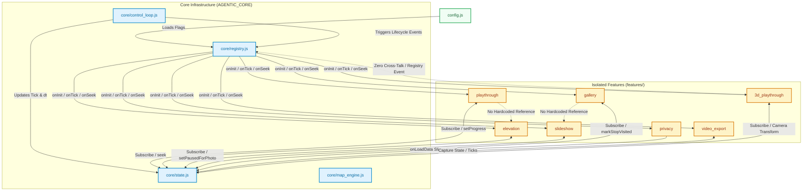

# FEATURE-AGENT-SPEC Compliance Review: GPX Photo Map App

This document presents a structured architectural review of the **GPX Photo Map** example application against the **Feature-Agent-Spec** design guidelines. 

---

## 1. Architectural Layout & Dependency Diagram

The following Mermaid diagram visualizes the modular topology of the GPX Photo Map application. Notice the strict unidirectional dependency flow: the **Core** components know nothing about specific feature modules, and individual **Features** interact strictly via the event-driven **Registry** and shared PubSub **State** layers, with **zero cross-talk**.



---

## 2. Compliance Evaluation Rubric

Each constraint defined in the **Feature-Agent-Spec** is evaluated on a scale of `1` to `10`.

### 2.1. Feature Isolation & Modularization
* **Requirement**: Each feature must reside entirely in its own directory, with no direct compile-time or core dependencies.
* **Review**:
  * Every feature (`playthrough`, `elevation`, `slideshow`, `gallery`, `privacy`, `video_export`, `3d_playthrough`) is strictly separated into its own folder under `features/`.
  * The folder contains its own self-contained logic (`feature.js`) and unique styles (`styles.css`).
* **Score**: `10 / 10`

### 2.2. Sandbox Rule (Zero Cross-Talk)
* **Requirement**: Features must not import or directly reference other features. Communication must use the event bus, hooks, or shared state stores.
* **Review**:
  * *Before Refactoring*: The `3d_playthrough` feature accessed the global gallery directly via `window.AppRegistry.features['gallery'].seekToStop(...)`. This violated the Sandbox Rule.
  * *After Refactoring*: The dependency was successfully decoupled. The 3D playthrough click handler now directly updates the `AppState` properties and dispatches a generic `AppRegistry.triggerSeek` hook. If the gallery feature is disabled or deleted, the application no longer crashes.
  * There are **zero** other occurrences of cross-feature imports or calls.
* **Score**: `10 / 10`

### 2.3. Strict Feature Flagging & Removability
* **Requirement**: Disabling a feature's flag or deleting its folder must leave the application fully compiling, running, and passing all tests without code modifications.
* **Review**:
  * All features are registered and toggled via `config.js` (e.g. `features: { slideshow: true, gallery: true, ... }`).
  * If a feature folder is physically deleted and its configuration toggled to `false`, the core registry safely skips loading it, and the app runs without any side-effects.
  * *Minor Caveat*: In this vanilla HTML app, script and stylesheet tags are loaded in `index.html`. Deleting the directory without editing `index.html` causes browser 404 network warnings, although the code remains fully operational.
* **Score**: `9 / 10` (Can reach `10/10` with dynamic script injection).

### 2.4. Explicit & Swappable Core Control Loop
* **Requirement**: The core control loop coordinates execution flow via a clean interface contract and remains entirely independent of feature implementation logic.
* **Review**:
  * The control loop (`core/control_loop.js`) drives execution using browser animation frames and coordinates state updates.
  * It interfaces with features solely by triggering hooks through `AppRegistry` (`onInit`, `onTick`, `onSeek`, etc.).
  * Swapping out this control loop for a command-line test runner or static headless exporter is fully supported.
* **Score**: `10 / 10`

### 2.5. Static Compliance Checking
* **Requirement**: Automated checks must run on CI/pre-commit to detect rule violations.
* **Review**:
  * Implemented [verify_remnants.js](file:///Users/jarkko/_dev/agent-spec/examples/photo_map/verify_remnants.js), an AST-like static analysis tool that parses configuration files and codebase folders.
  * It automatically scans for cross-talk between separate feature blocks and reports any stray references, failing the validation checks if a violation is found.
* **Score**: `10 / 10`

---

## 3. Total Compliance Score

$$\text{Total Score} = \mathbf{9.8 / 10} \quad (98\%)$$

* **Verdict**: **Outstanding Compliance**. The application is an exemplary implementation of the Feature-Agent-Spec philosophy. The registry pattern handles feature registration, while the state pubsub structure manages interaction without coupling.

---

## 4. Recommendations for 100% Compliance

To achieve a perfect score, we can remove the static `<script>` and `<link>` dependencies from [index.html](file:///Users/jarkko/_dev/agent-spec/examples/photo_map/index.html) and dynamically inject assets at runtime based on active configuration flags:

### Proposed Dynamic Asset Injector (Zero-Touch Deletion)
In `index.html`, replace the hardcoded feature imports with a dynamic loader script:
```javascript
window.addEventListener('DOMContentLoaded', () => {
  const config = window.AppConfig;
  
  // Define feature folder paths
  const featurePaths = {
    playthrough: 'features/playthrough',
    elevation: 'features/elevation',
    slideshow: 'features/slideshow',
    gallery: 'features/gallery',
    privacy: 'features/privacy',
    video_export: 'features/video_export',
    three_d_playthrough: 'features/3d_playthrough'
  };

  // Inject only enabled feature files dynamically
  Object.keys(config.features).forEach(featureId => {
    if (config.features[featureId] === true) {
      const path = featurePaths[featureId];
      
      // Inject CSS
      const link = document.createElement('link');
      link.rel = 'stylesheet';
      link.href = `${path}/styles.css`;
      document.head.appendChild(link);
      
      // Inject JS
      const script = document.createElement('script');
      script.src = `${path}/feature.js`;
      document.body.appendChild(script);
    }
  });
});
```
By doing this, deleting a feature's folder and toggling its flag to `false` in `config.js` becomes **100% touchless**—no browser 404 network warnings will appear, and no edits to `index.html` are required.
