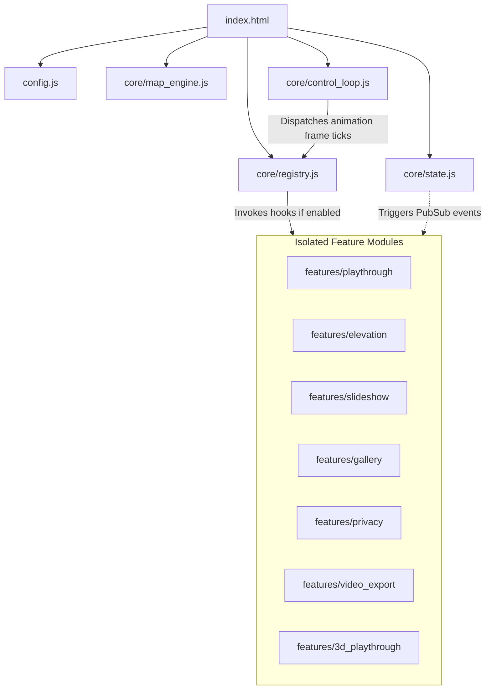

# GPX Photo Map Playthrough (Agentic Architecture)

This application is an interactive GPX playthrough map that animates ride progress along a track, renders real-time stats and an SVG elevation profile, auto-pauses at photo stops to display slideshows, and unlocks thumbnail icons in a visited sidebar.

It is implemented following the **Feature-Agent-Spec** design principles defined in [README.md](file:///Users/jarkko/_dev/agent-spec/README.md). The application favors strict modular isolation, runtime feature-flagging, and a swappable core control loop.

* **Playthrough**: Handles the animated bike marker, playback HUD (play/pause/seek), and real-time statistics updating based on progress.
* **Elevation**: Renders an interactive SVG chart that maps route distance to elevation, allowing for coordinate seeking by clicking the profile.
* **Slideshow**: Evaluates route distances on tick, triggers auto-pauses when photos are passed, displays the slideshow viewport overlay, animates thumbnail cross-fades, and executes countdown timers.
* **Gallery**: Displays a grid of visited photos in the sidebar with floating hover previews, customized marker positioning, and an interactive fullscreen slideshow overlay modal synced with map viewport updates.
* **Privacy**: Intercepts and filters route coordinates and photo stops inside configurable start/stop circular radii, providing overlay sliders, a seamless start/stop join loop checkbox, and LocalStorage configuration sync.
* **Video Export**: Ingests canvas frames via MediaRecorder API to export high-definition WebM video captures of the playthrough.
* **3D Playthrough**: Provides a swappable interface offering 3D Perspective (Leaflet CSS tilt/orbit) and true 3D Flight (MapLibre WebGL topography terrain elevation) viewports.

---

## 1. Directory Structure

```
photo_map/
├── index.html                   # HTML page shell and application bootstrapping
├── config.js                    # Feature flags and loader configuration
├── styles.css                   # Base stylesheet resets & UI styling tokens
├── verify_remnants.js           # Static compliance validation tool
├── data/
│   └── route_data.js            # Extracted route coordinates & timing controls
├── core/
│   ├── registry.js              # Event hooks manager (Init, Tick, Seek, etc.)
│   ├── state.js                 # Global observable state store
│   ├── map_engine.js            # Leaflet map instance controller wrapper
│   └── control_loop.js          # requestAnimationFrame timing coordinator
└── features/                    # Isolated feature scripts and styling
    ├── playthrough/             # Animated bike marker, controls, stats HUD
    ├── elevation/               # SVG chart profile timeline and click seeking
    ├── slideshow/               # Timing checks, overlay slideshows, countdowns
    ├── gallery/                 # Visited photos side-panel & thumbnail markers
    ├── privacy/                 # Mask start/stop locations via radius trimming
    ├── video_export/            # Captures and exports WebM video files
    └── 3d_playthrough/          # CSS Perspective & WebGL terrain 3D modes
```

---

## 2. Architectural Design & Flow



### 2.1 Core Orchestration Layer
1. **State Store (`core/state.js`)**: Coordinates all app variables (`currentProgressKm`, `isPlaying`, etc.) and performs geographic distance computations. It exposes a simple publish-subscribe (`subscribe(event, callback)`) interface so components can react to state changes asynchronously.
2. **Registry (`core/registry.js`)**: Receives registrations from features. Toggles callback execution based on feature flags in `config.js`. Dispatches system events:
   - `onInit(context)`: Sets up feature maps, structures, and DOM bindings.
   - `onTick(context)`: Ticks feature states along requestAnimationFrame time changes.
   - `onSeek(context, km)`: Synchronizes feature playheads to specified progress values.
   - `onPlayStateChange(context, isPlaying)`: Notifies components when play/pause status toggles.
   - `onReset(context)`: Reverts feature configurations to defaults.
3. **Control Loop (`core/control_loop.js`)**: Manages rendering frames. It is interface-abstracted; replacing this class with a custom timestep simulator (for frame capture video exports) requires no edits inside the feature scripts.
4. **Map Engine (`core/map_engine.js`)**: Construct and manages the Leaflet canvas context, route path polyline renderer, and overlay grouping contexts.

---

## 3. Extending the Codebase

### 3.1 How to Disable/Enable Features
Toggle flags inside [config.js](file:///Users/jarkko/_dev/agent-spec/examples/photo_map/config.js):
```javascript
window.AppConfig = {
  features: {
    playthrough: true,
    elevation: false, // Disables elevation SVG rendering completely
    slideshow: true,
    gallery: true,
    three_d_playthrough: true
  }
};
```
If a feature flag is set to `false`, the Registry bypasses its hooks, and the dynamic loader skips importing its assets.

### 3.2 How to Delete a Feature
To completely remove a feature (e.g., `elevation`) from the codebase without leaving broken remnants:
1. Delete its folder: `features/elevation/`.
2. Remove its name flag from [config.js](file:///Users/jarkko/_dev/agent-spec/examples/photo_map/config.js).

*Because assets are loaded dynamically at runtime, the application will boot and compile successfully without generating 404 network warnings or requiring edits to `index.html`.*

### 3.3 How to Add a Feature
To introduce a new module (e.g., `weather_radar`):
1. Create a folder `features/weather_radar/`.
2. Implement your logic in `features/weather_radar/feature.js`:
   ```javascript
   class WeatherRadarFeature {
     onInit(context) {
       // Render HTML overlay, setup markers
     }
     onTick(context) {
       // Update radar opacity based on context.state
     }
   }
   window.AppRegistry.register('weather_radar', new WeatherRadarFeature());
   ```
3. Create styles in `features/weather_radar/styles.css`.
4. Register the folder name in [index.html](file:///Users/jarkko/_dev/agent-spec/examples/photo_map/index.html)'s feature path mapping (inside `loadFeatureAssets`), and toggle its flag in [config.js](file:///Users/jarkko/_dev/agent-spec/examples/photo_map/config.js):
   ```javascript
   // config.js
   features: {
     ...
     weather_radar: true
   }
   ```
   *The dynamic loader will mount the JS and CSS files automatically upon launch.*
